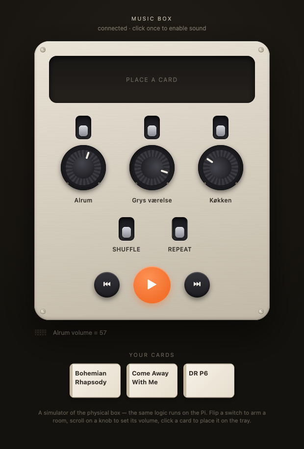

# Music Box

A phone-free way to control our Sonos speakers at home.

Place a physical card on the device, press play, and a corresponding album,
playlist, or radio station starts playing on one or more speakers. No screen to
get lost in, no app to open — just a tactile object and a button.

> **Status:** Scoping / idea phase. This README is a living design document.
> Nothing is built yet. Decisions marked **(open)** are still to be made.

---

## Motivation

When I'm home, I want to fully put my phone away. Today, playing music on our
3 Sonos speakers requires picking music or a radio station through the Sonos
app on my phone every single time. That pulls the phone back into my hand — and
my attention with it.

The Music Box replaces that with a physical, ambient interaction:

- Pick a card (album / playlist / radio station / mood).
- Place it on the box.
- Press play.
- Music plays on the speaker(s).

The phone stays away.

---

## Core concept

```
   [ physical card ]                  [ Sonos speakers ]
          │                                   ▲
          ▼                                   │
   ┌──────────────┐     local network /       │
   │  Music Box   │ ───── UPnP / API ─────────┘
   │  (no display)│
   │  buttons +   │
   │  card reader │
   └──────────────┘
          ▲
          │ configuration over Wi-Fi / Bluetooth
          │ (map card → music, no display needed on device)
   [ phone / laptop, only for setup ]
```

The phone is still allowed for **one-time configuration** (mapping a card to a
playlist). The goal is zero phone use for **everyday playback**.

---

## Goals

- **No general-purpose display.** Buttons only. Optionally a minimal display for
  track progress / time elapsed / volume — nothing you'd "browse".
- **Tactile cards** to select what plays.
- **One or more speakers** targetable per action (grouping).
- **Configuration off-device** — over local network and/or Bluetooth, from a
  phone or laptop.
- **Built from off-the-shelf electronics + 3D-printed enclosure** (Prusa Core One).
- Reliable and fast enough that it actually replaces the app for daily use.

## Non-goals (for now)

- Not trying to replicate the full Sonos app.
- No on-device music browsing/search.
- No cloud service of our own — keep everything local where possible.

---

## Open questions to scope together

These are the big decisions. We'll work through them and record the outcomes here.

### 1. Card technology **(DECIDED: NFC)**
**NFC tags** — an NTAG215 sticker hidden inside each 3D-printed card, read by a
PN532/RC522 reader in the box. Cheap (~€0.20/card), batteryless, scales to 100s,
solder-free modules exist. The card just rests on a marked "spot." Each tag's UID
(or a written ID) maps to a Sonos Favorite in the box config.

### 2. The "brain" **(leaning Raspberry Pi — see findings)**
What runs the logic and talks to Sonos?
- **Raspberry Pi Zero 2 W** — runs Linux + Python, uses [SoCo] directly, hosts the
  config web app easily. The findings make this the strong default: SoCo is the
  proven, maintained path and needs a real OS. Boots slower / more power than an MCU,
  but for an always-on box that's fine.
- **ESP32** — cheap, instant-on, but would need raw UPnP reimplemented (no SoCo) and
  the config web app is more work. Findings push this *down* the list.
- Other (Pi 4/5, etc.) — overkill but flexible.

[SoCo]: https://github.com/SoCo/SoCo

### 3. How we talk to Sonos **(open)**
- **Local UPnP control** (SoCo) — no internet dependency, works on the LAN.
- Sonos **favorites** as the unit of selection — easiest mapping target: a card
  → a Sonos favorite (which can be an album, playlist, or radio station).
- Music sources we care about (**decided**, see findings below): **Apple Music**,
  **DR radio + DR podcasts** (via the **DR LYD** Sonos service). Other services
  can be added later. Podcasts beyond DR are a known gap — see findings.

### 4. Buttons & controls **(DECIDED — see "Control scheme" below)**
Settled on, per room: a **latching toggle switch** (arm/disarm) **and** a separate
**volume knob** (rotary encoder). Plus **shuffle** + **repeat** toggle switches,
**previous / play / next** buttons, and a **piezo buzzer** for audio feedback. No
dedicated mute (flip a room off, or turn its knob to zero).

### 5. Display: none vs. minimal **(open)**
- None at all.
- Minimal: small OLED / e-ink showing track name + elapsed/remaining time +
  volume. Nice-to-have, not required for v1.

### 6. Configuration interface **(open)**
- Small **web app** served by the box on the LAN (open a page, see detected
  cards, assign each to a Sonos favorite). Works from any device.
- **Bluetooth** companion flow (more app-like, more work).
- Web app is the likely default; it's the least effort and most flexible.

### 7. Card ↔ action model **(open)**
What can a card encode?
- A specific favorite (album/playlist/station).
- A target speaker or group.
- A "mood" that maps to a rotating set.
- Just an ID; all meaning lives in the box's config (most flexible).

### 8. Power **(open)**
- USB-C wall power (simplest).
- Battery + charging (portable, more complexity).

---

## Technical findings: Sonos & Bluetooth (researched 2026-06-06)

A research pass into how the box can actually drive speakers. Sources are linked
at the bottom of this section.

### Two fundamentally different speaker models

This is the single most important realization, and it shapes the whole project:

- **Sonos = the box is a _controller_.** Sonos speakers are networked players that
  stream music *themselves* (directly from Apple Music's / DR's servers over your
  Wi-Fi). The box only sends commands like "play favorite X on the kitchen
  speaker." The box never touches the audio. This is lightweight, reliable, and
  a great fit for a small always-on device.
- **Bluetooth speaker = the box is the _audio source_.** A plain Bluetooth speaker
  has no idea what Apple Music is. The box itself would have to fetch, decode, and
  stream the audio over Bluetooth. That's a much heavier job — **and there is no
  good way to play Apple Music from a headless Linux device** (no official API /
  client). So **Bluetooth + Apple Music is effectively a dead end.** Bluetooth
  could work for *local files, internet radio, and podcast RSS streams*, but not
  our main source.

**Implication:** scope **v1 to Sonos only** (controller model). Bluetooth output
can be a *later, separate mode* limited to radio/podcasts/local files — not a
drop-in for Apple Music. ([Phoniebox] does BT this way, with local/Spotify audio.)

### How the box talks to Sonos

- **Local control via [SoCo]** (Python, UPnP over the LAN) is the recommended path.
  It is **actively maintained in 2026**, works on current Sonos S2 devices, and
  needs **no cloud account and no internet** for the control commands themselves.
- Sonos also has an **official cloud Control API**, but it requires OAuth + their
  cloud and has been less reliable (and the `getFavorites` cloud endpoint is
  reported as buggy). For an always-on local box, **local SoCo is the better bet.**
- SoCo handles the things we need: play/pause, next/prev, volume, **speaker
  grouping** (one or more speakers per action), and **listing/playing Sonos
  Favorites**.

### The Apple Music catch — and the workaround

- Apple Music on Sonos is an **account-linked service** using Sonos's SMAPI. Starting
  Apple Music playback *directly* by URI through SoCo / the API is **unreliable**
  (Apple Music, Spotify, Amazon are all flagged with auth/playback issues).
- **The robust pattern: Sonos Favorites.** You add the albums/playlists/stations you
  want to **My Sonos → Favorites** *once* in the Sonos app. The box then lists those
  favorites via SoCo and plays them by name. This sidesteps the broken
  direct-playback path and works across services.
- **Consequence for the card model:** each card maps to a **named Sonos Favorite**
  (+ a target speaker/group). Setup flow = "add it to Sonos Favorites, then assign a
  card to it" in our config web app. This scales fine to **100s of cards**.

### DR radio & podcasts — good news

- **DR LYD is a first-class Sonos music service** (Danish). It carries DR's **live
  radio channels, on-demand shows, _and_ podcasts**. So DR radio *and* DR podcasts
  are both reachable — save them as Sonos Favorites like anything else.
- **Podcasts outside DR — solvable, and even feasible in v1.** Apple **Podcasts** is
  *not* a Sonos service, but a podcast is just an **RSS feed whose episodes are plain
  HTTP audio URLs**. So the box can fetch the feed, pick the latest/next episode, and
  hand its `.mp3`/`.aac` URL to Sonos via `play_uri()` — the speaker streams it itself.
  A card → "the RSS URL for *Podcast X*". Open design bits: "latest vs. resume" per
  card, and remembering playback position. Not a blocker.

### Can the box play audio over Bluetooth later? (Pi Zero 2 W)

- **Yes — the Pi Zero 2 W is powerful enough.** Built-in Bluetooth + quad-core CPU can
  decode MP3/AAC/FLAC and stream to a BT speaker as an **A2DP source** (`bluez` +
  `bluealsa`). [Phoniebox] does exactly this on Pi-Zero-class hardware.
- **The limit is licensing, not CPU.** Local files, internet radio, and podcast RSS
  audio can all go out over Bluetooth. **Apple Music cannot** (no headless Linux
  client) — so BT output would be a radio/podcasts/local-files mode, never Apple Music.
- Net: choosing the Pi Zero 2 W keeps the future Bluetooth-output option open with no
  regret.

### Prior art worth studying

- **[Phoniebox] (RPi-Jukebox-RFID)** — mature Raspberry Pi + RFID jukebox; plug-and-play
  over USB, *no soldering required*, supports web radio/podcasts/Spotify and BT output.
  Great reference for the RFID + config-web-app + assembly approach, even though it
  targets local/Spotify rather than Sonos.
- **[zacharycohn/jukebox]** — a Raspberry Pi + NFC + **SoCo** Sonos jukebox. Closest to
  our concept; maps NFC tags → playlists. Confirms the SoCo approach works.

[SoCo]: https://github.com/SoCo/SoCo
[Phoniebox]: https://github.com/MiczFlor/RPi-Jukebox-RFID
[zacharycohn/jukebox]: https://github.com/zacharycohn/jukebox

---

## Control scheme (decided 2026-06-06)

No general-purpose display. State is shown by the physical controls themselves
(a toggle's position, an encoder's LED) rather than a screen.

```
            ┌──────────────────────────────┐
            │   ·  place card here  ·       │   <- NFC "spot"
            │                               │
            │   |ON    |ON    |ON           │   <- room toggle switch (up = armed)
            │   (O)    (O)    (O)            │   <- room volume knob (turn only)
            │  Alrum  Køkken  Grys           │
            │  [ shuffle ]   [ repeat ]      │   <- mode toggle switches
            │                               │
            │   (<<)   ( PLAY )   (>>)       │   <- previous · play/pause · next
            └──────────────────────────────┘
                                              ((•)) piezo buzzer (audio feedback)
```

- **Per room (Alrum / Køkken / Grys værelse): a latching toggle switch + a volume knob,
  as two separate controls.**
  - **Toggle switch** = arm/disarm that room. Its physical position *is* the armed
    indicator — flipped up = in the group. No LED or screen needed.
  - **Volume knob** = that room's volume. A **rotary encoder** (relative, "turn up/down")
    rather than a potentiometer, because the Pi has no analog input — an encoder reads
    cleanly over GPIO. Maps to SoCo per-room volume.
  - (Earlier we considered one push-rotary encoder doing both; separated on 2026-06-06
    so each control does one obvious thing and arming is visible.)
- **Play** button: group the currently-armed rooms (SoCo `join`/`unjoin`) and play
  the favorite mapped to the card sitting on the spot. Press again = pause/resume.
  - **If no room is armed, `play` does nothing** except sound a short **error beep**
    (see buzzer below). No silent no-op, no surprise default room.
- **Previous / Next** buttons: skip within the current queue (SoCo `previous()` /
  `next()`). Some favorites are single tracks where skip won't apply — that's fine.
- **Shuffle** and **Repeat** toggle switches: map to SoCo `play_mode`
  (NORMAL / SHUFFLE / REPEAT_ALL / SHUFFLE_NOREPEAT). Their physical position *is*
  the state indicator — no screen needed.
- **Piezo buzzer (audio feedback):** a small piezo on a GPIO pin gives a screenless
  device a voice. Yes, the Pi does this easily — a passive piezo + PWM can play tones,
  an active one just beeps; it does **not** use the (absent) audio jack. Planned cues:
  - card recognized → short rising chirp
  - room armed / disarmed → soft click (arm) / lower click (disarm)
  - play started → confirmation blip
  - **error (e.g. play with no room armed, or unknown card) → low error buzz**
- **Optional minimal display (later):** small OLED for track + elapsed/remaining
  time + a volume blip. Nice-to-have, not v1.
- **Mute:** no dedicated control — the existing controls cover both intents.
  Flip a room's switch off (`unjoin`, stops it) or turn its knob to zero (stays grouped, silent).
- **Still open:** whether arming a room while audio is already playing should hand it
  the current track immediately or wait for the next play.

---

## Likely architecture (first hypothesis, to be challenged)

> This is a starting point, **not** a committed decision.

- **Raspberry Pi Zero 2 W** running Python.
- **PN532 NFC reader** over SPI/I²C; cards are 3D-printed holders with an NFC
  sticker inside.
- **[SoCo](https://github.com/SoCo/SoCo)** for local Sonos control; each card maps
  to a **named Sonos Favorite** + target speaker/group (see findings above for why
  Favorites, not direct Apple Music URIs).
- A few **momentary push buttons** (play/pause, vol ±, next).
- Optional **small OLED** for track + time.
- A **local web app** (served from the Pi) for configuration: scan a card, pick
  the favorite + target speakers, save.
- **USB-C** powered.
- **3D-printed enclosure** with a card "slot" or "tray" and recessed buttons.

---

## Hardware (to be finalized)

| Part | Candidate | Notes |
|------|-----------|-------|
| Compute | Raspberry Pi Zero 2 W | Chosen — needs an OS for SoCo + web config |
| Card reader | PN532 (I²C/SPI) | NFC; PN532 preferred over RC522 for interface flexibility |
| Cards | NTAG215 stickers in printed holders | Cheap, batteryless, 100s scale |
| Room arm | 3× latching toggle switch | One per room; switch position = armed state |
| Room volume | 3× rotary encoder | One per room; relative (no ADC needed on the Pi) |
| Mode switches | 2× toggle switch | Shuffle, repeat (position shows state) |
| Transport | 3× momentary button | Previous, play/pause, next |
| Audio feedback | 1× piezo buzzer (GPIO) | Chirps/clicks/error beep; no audio jack needed |
| Display | SSD1306 OLED (optional, later) | Track + time only |
| Power | USB-C | TBD |
| Enclosure | 3D printed (Prusa Core One) | Card spot + encoders + switches |

## Software so far

All control logic lives in `software/musicbox/` (the `MusicBox` core) with **no UI
or hardware dependency** — so the CLI, the web simulator, and eventually the Pi's
GPIO buttons are all thin front-ends over the same brain.

- **`software/spike_sonos.py`** — the original de-risking spike (discover / list
  favorites / play one). ✅ validated against the real speakers.
- **`software/musicbox/`** — the core: room arming/grouping, per-room volume, play
  modes, transport, card→favorite playback, and the buzzer cue vocabulary.
- **CLI simulator** — `python -m musicbox`, simulates the panel via typed commands.
- **Web simulator** — `python -m web.server`, a faceplate that looks like the box
  and plays the buzzer cues in the browser. Doubles as a head start on the
  "configure over the network" requirement.
- **`software/tests/`** — logic tests with fake speakers (no Sonos needed).

```
cd software
python3 -m venv .venv && source .venv/bin/activate
pip install -r requirements.txt
python -m web.server          # then open http://localhost:8080
```



*The web simulator: warm 3D-printed-style enclosure, per-room arm switches + volume
knobs (level shown by pointer rotation, no display), shuffle/repeat flips,
prev/play/next, a card tray, and your deck of cards. Drives the real Sonos.*

## Repository layout

```
/software                # the code (musicbox core, CLI, web simulator, tests)
/hardware                # wiring diagrams, BOM, pinouts (to come)
/cad                     # 3D models / STLs for the enclosure and cards (to come)
/docs                    # design notes, decisions, the UI preview
```

---

## Roadmap (rough)

1. **Decide the open questions above** (this phase).
2. **Spike**: get Python + SoCo controlling our actual Sonos speakers from a
   laptop — prove playback control end to end.
3. **Spike**: read an NFC card ID on the chosen brain.
4. Wire card → Sonos favorite → playback (breadboard, no enclosure).
5. Add buttons.
6. Build the config web app.
7. Design + print the enclosure and cards.
8. Assemble, polish, live with it, iterate.

---

## Notes / decisions log

### 2026-06-06 — Control revision: separate arm switch from volume knob
Superseded the "one push-rotary encoder does both" idea. Per room there are now
**two** controls: a **latching toggle switch** to arm/disarm (position shows state)
and a **separate volume knob** (rotary encoder). Reason: each control does one
obvious thing, and arming is visibly indicated without relying on a hidden "push the
knob" gesture. Costs a few more panel holes; worth it for clarity.

### 2026-06-06 — Sonos spike VALIDATED ✅
Ran `software/spike_sonos.py` against the real speakers. All three commands
worked first try:
- **Discovery** found 3 speakers: `Alrum`, `Grys værelse`, `Køkken`.
- **Favorites** listed 17 Sonos Favorites (mix of Apple Music tracks, DR /
  Sonos Radio, kids' content).
- **Play** started an **Apple Music** favorite ("Bohemian Rhapsody") on `Køkken`.

**Conclusion:** the core control assumption holds. Apple Music playback via
Sonos Favorites + local SoCo works end to end. Biggest project risk is retired.

Follow-up note: today's favorites are mostly individual *tracks*. For the real
device we'll want to also save *albums / playlists / radio stations* as
Favorites in the Sonos app — they work the same way, just longer-playing.

### 2026-06-06
- **Music sources for v1:** Apple Music, DR radio, DR podcasts (DR radio + podcasts
  both via the DR LYD Sonos service). Other services later.
- **Card count:** must scale to **100s** of cards.
- **Builder skill:** new to soldering/breadboarding but keen to learn → favor
  solder-free / plug-together modules where possible (e.g. Phoniebox-style).
- **Speaker target for v1:** **Sonos only** (controller model). Bluetooth output
  deferred to a possible later mode, and noted as **incompatible with Apple Music**.
- **Sonos control method:** local **SoCo** (UPnP, no cloud) is the chosen approach.
- **Card → action model:** each card = a **named Sonos Favorite** + target speaker/group.
  Pre-add content to Sonos Favorites once, then assign cards to favorites in config.
- **Brain:** leaning **Raspberry Pi Zero 2 W** (needed for SoCo + web config).
- **Known limitation:** non-DR podcasts (e.g. Apple Podcasts) aren't a Sonos service;
  reachable later via RSS → direct audio URL, out of scope for v1's first cut.
- **Card tech:** **NFC** (NTAG215 in printed cards + PN532 reader). See open question 1.
- **Controls:** **one push-rotary encoder per room** (push = arm/disarm, turn = volume),
  **shuffle** + **repeat** toggle switches, **previous / play / next** buttons. No
  screen; control positions/LEDs show state. Volume is per-room via the knobs.
- **Play with no room armed:** do nothing except sound an **error beep**.
- **Audio feedback:** add a **piezo buzzer** on a GPIO pin for card-recognized chirps,
  arm/disarm clicks, play confirmation, and error beeps. Confirmed the Pi can drive
  this directly (PWM tones / active beep) without using an audio output.
